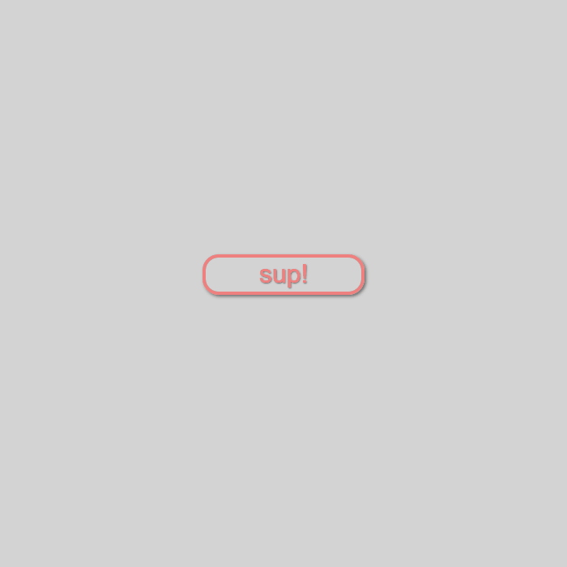

# button hover shiney
 Fazer um botão com efeito de reflexo

#### O que foi utilizado:

<ul>
<li>transition</li>
<li>skewY</li>
</ul>

## Esse é um extra :D 

## inspirado por -> https://codepen.io/bigglesrocks/pen/RPzNjw
