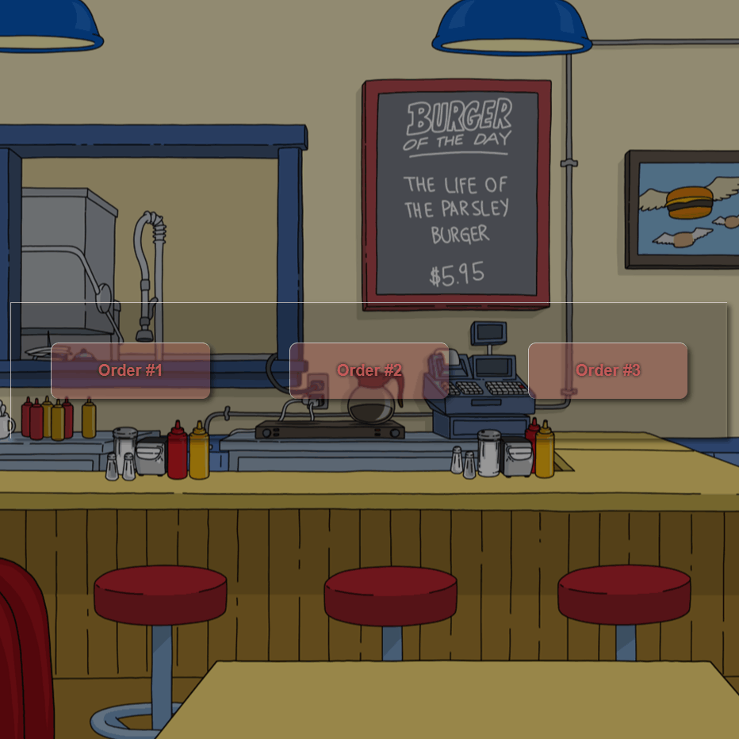

# Checkbox animado
 Fazer um checkbox animado.

## extra
decidi experimentar um pouco de Glass morphism 😛

#### O que foi utilizado:

<ul><li>:before</li>
<li>transition</li>
<li>backdrop-filter</li>
</ul>