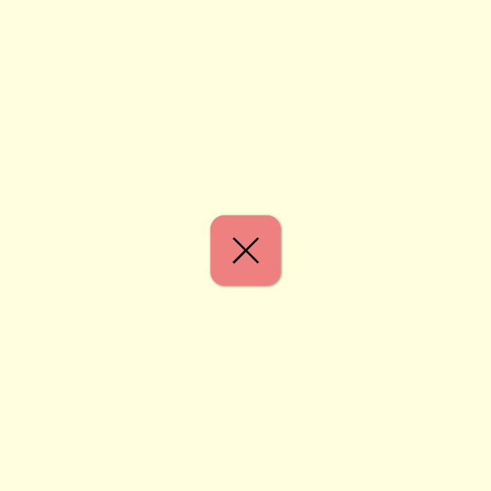

# Checkbox animated bars
 Fazer um checkbox que vire as barrinhas formando um X e um V.

#### O que foi utilizado:

<ul>
<li>transition</li>
<li>transfom</li>
<li>nth-child</li>
</ul>

## Esse é um extra :D 
